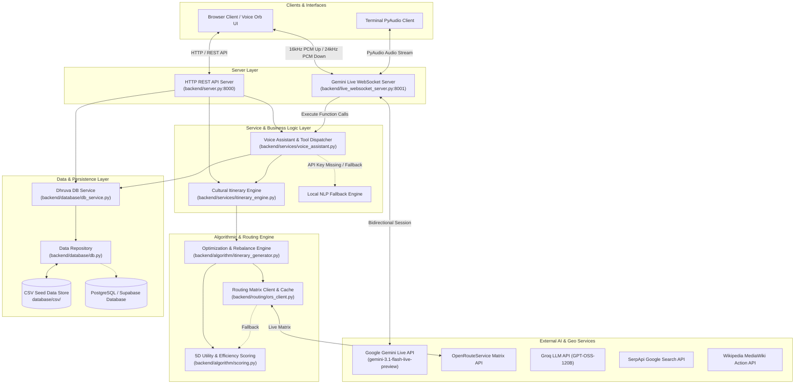
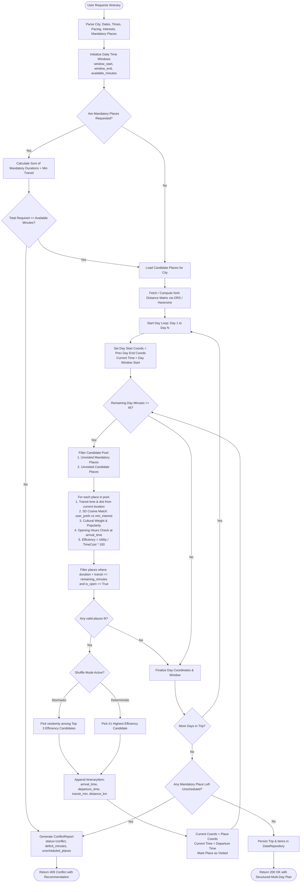
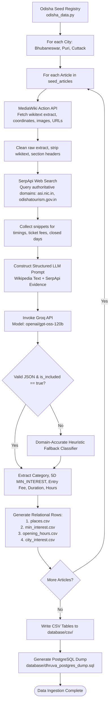

# DHRUVA — Comprehensive Technical Overview (Backend & Core Services)

> **Document Version:** 1.0.0  
> **Target Scope:** Core Backend, Algorithmic Engine, Routing Client, Voice Assistant, Database Layer, Data Ingestion Pipeline, and Utility Tooling (excluding Frontend UI).

---

## Table of Contents

1. [Executive Summary & Architectural Philosophy](#1-executive-summary--architectural-philosophy)
2. [End-to-End System Flowcharts](#2-end-to-end-system-flowcharts)
   - [High-Level Architectural Topology](#21-high-level-architectural-topology)
   - [Itinerary Generation & Optimization Flowchart](#22-itinerary-generation--optimization-flowchart)
   - [Gemini Live Bidirectional Audio & Tool Execution Flowchart](#23-gemini-live-bidirectional-audio--tool-execution-flowchart)
   - [Data Ingestion & Classification Pipeline Flowchart](#24-data-ingestion--classification-pipeline-flowchart)
3. [Domain Models & Data Layer](#3-domain-models--data-layer)
   - [Domain Entities (`backend/database/models.py`)](#31-domain-entities-backenddatabasemodelspy)
   - [Data Repository & In-Memory Storage (`backend/database/db.py`)](#32-data-repository--in-memory-storage-backenddatabasedbpy)
   - [High-Level Database Service (`backend/database/db_service.py`)](#33-high-level-database-service-backenddatabasedb_servicepy)
   - [Relational Database Schema (`database/postgres_schema.sql`)](#34-relational-database-schema-databasepostgres_schemasql)
4. [Scoring & Utility Algorithm](#4-scoring--utility-algorithm)
   - [5D Cosine Similarity Mathematical Formulation](#41-5d-cosine-similarity-mathematical-formulation)
   - [Composite Utility & Cultural Weighting](#42-composite-utility--cultural-weighting)
   - [Time-Efficiency Metric & Penalty Modeling (`backend/algorithm/scoring.py`)](#43-time-efficiency-metric--penalty-modeling-backendalgorithmscoringpy)
5. [Itinerary Optimization & Chaining Engine](#5-itinerary-optimization--chaining-engine)
   - [Mandatory Place Feasibility & Conflict Detection](#51-mandatory-place-feasibility--conflict-detection)
   - [Sequential Daily Chaining & Time-Window Packing (`backend/algorithm/itinerary_generator.py`)](#52-sequential-daily-chaining--time-window-packing-backendalgorithmitinerary_generatorpy)
   - [Dynamic Insertion, Removal & Downstream Rebalancing](#53-dynamic-insertion-removal--downstream-rebalancing)
   - [3-Shuffle Alternative Variation Generator](#54-3-shuffle-alternative-variation-generator)
6. [Routing Matrix & Distance Client](#6-routing-matrix--distance-client)
   - [OpenRouteService Client & Caching Layer (`backend/routing/ors_client.py`)](#61-openrouteservice-client--caching-layer-backendroutingors_clientpy)
   - [Haversine Road-Winding Fallback Model](#62-haversine-road-winding-fallback-model)
7. [Cultural Planning Service](#7-cultural-planning-service)
   - [Cultural Pacing & Senior-Friendly Buffers (`backend/services/itinerary_engine.py`)](#71-cultural-pacing--senior-friendly-buffers-backendservicesitinerary_enginepy)
8. [Voice Assistant & Real-Time Gemini Live Subsystem](#8-voice-assistant--real-time-gemini-live-subsystem)
   - [Function Calling Tool Registry (`backend/services/voice_assistant.py`)](#81-function-calling-tool-registry-backendservicesvoice_assistantpy)
   - [Conversational Fallback NLP Engine](#82-conversational-fallback-nlp-engine)
   - [Bidirectional WebSocket PCM Streaming Bridge (`backend/live_websocket_server.py`)](#83-bidirectional-websocket-pcm-streaming-bridge-backendlive_websocket_serverpy)
9. [HTTP REST API Server](#9-http-rest-api-server)
   - [Zero-Dependency Dispatcher & Endpoints (`backend/server.py`)](#91-zero-dependency-dispatcher--endpoints-backendserverpy)
   - [API Request/Response Contract Reference](#92-api-requestresponse-contract-reference)
10. [Data Ingestion, Wikipedia Scraping & Enrichment Pipeline](#10-data-ingestion-wikipedia-scraping--enrichment-pipeline)
    - [MediaWiki Action API Crawler (`scraper/mediawiki_client.py`)](#101-mediawiki-action-api-crawler-scrapermediawiki_clientpy)
    - [SerpApi Web Search Evidence Provider (`scraper/search_client.py`)](#102-serpapi-web-search-evidence-provider-scrapersearch_clientpy)
    - [LLM Synthesis & Classification Engine (`scraper/llm_processor.py`)](#103-llm-synthesis--classification-engine-scraperllm_processorpy)
    - [Pipeline Orchestrator & Exporters (`scraper/pipeline.py`, `scraper/cli.py`)](#104-pipeline-orchestrator--exporters-scraperpipelinepy-scraperclipy)
11. [Standalone Scripts & Utilities](#11-standalone-scripts--utilities)
    - [Microphone Live Streaming Client (`scripts/live_audio_stream.py`)](#111-microphone-live-streaming-client-scriptslive_audio_streampy)
    - [Terminal Live Voice Assistant (`scripts/run_live_assistant.py`)](#112-terminal-live-voice-assistant-scriptsrun_live_assistantpy)
    - [Frontend Mock Synchronizer (`scripts/sync_frontend_mock.py`)](#113-frontend-mock-synchronizer-scriptssync_frontend_mockpy)
12. [Configuration, Settings & Testing Suite](#12-configuration-settings--testing-suite)
    - [Configuration Management (`backend/config.py`)](#121-configuration-management-backendconfigpy)
    - [Test Suite Architecture (`backend/tests/`)](#122-test-suite-architecture-backendtests)

---

## 1. Executive Summary & Architectural Philosophy

**DHRUVA** is a cultural, spiritual, and heritage travel-planning platform designed for India, with an initial focus on the state of Odisha (Bhubaneswar, Puri, Cuttack).

The backend architecture is designed around several core principles:
1. **Zero Mandatory External Infrastructure at Runtime:** The system can boot, load relational data from CSVs, compute 5D cosine rankings, execute routing matrices, and generate multi-day itineraries using purely standard Python 3.10+ libraries (`http.server`, `urllib`, `math`, `dataclasses`).
2. **Transparent, Multi-Factor Utility Scoring:** No opaque black-box recommendations; every attraction score is mathematically broken down into User Interest Match, Popularity, Cultural Heritage Weight, Travel Time, Visit Duration, and Opening Hours compliance.
3. **Decoupled Relational Persistence:** Supports seamless dual storage: an in-memory graph repository synced from normalized CSVs, and an enterprise PostgreSQL / Supabase schema with full relational constraints.
4. **Deterministic Pacing & Time-Window Feasibility:** Guarantees that generated schedules respect opening hours, travel transitions, fatigue pacing, and mandatory user constraints.
5. **Real-Time Gemini Live Audio Integration:** Low-latency bidirectional PCM voice communication over WebSockets bridging browser Web Audio, Google Gemini Live API, local database tool execution, and UI navigation hand-offs.

```
Dhruva/
├── backend/
│   ├── config.py                 # Central settings & .env parser
│   ├── server.py                 # Multi-threaded HTTP REST API server
│   ├── live_websocket_server.py  # Gemini Live bidirectional PCM audio WebSocket bridge
│   ├── database/
│   │   ├── models.py             # Dataclass domain entities
│   │   ├── db.py                 # In-memory relational repository & CSV loader
│   │   └── db_service.py         # High-level database query and aggregation service
│   ├── algorithm/
│   │   ├── scoring.py            # 5D cosine similarity & time-efficiency scoring
│   │   └── itinerary_generator.py # Multi-day optimization, conflict detection & rebalancer
│   ├── routing/
│   │   └── ors_client.py         # OpenRouteService matrix client & Haversine fallback
│   ├── services/
│   │   ├── itinerary_engine.py   # Cultural planning engine with fatigue pacing
│   │   └── voice_assistant.py    # Voice tool executor & local fallback NLP
│   └── tests/                    # 76 Unit and integration tests
├── database/                     # PostgreSQL DDL, dump files, and normalized CSVs
├── scraper/                      # MediaWiki API + SerpApi + Groq LLM data pipeline
└── scripts/                      # Standalone audio streaming & sync scripts
```

---

## 2. End-to-End System Flowcharts

### 2.1 High-Level Architectural Topology



---

### 2.2 Itinerary Generation & Optimization Flowchart



---

### 2.3 Gemini Live Bidirectional Audio & Tool Execution Flowchart

```mermaid
sequenceDiagram
    autonumber
    actor User as Traveler (Browser / Microphone)
    participant WS as WebSocket Bridge (live_websocket_server.py)
    participant Gemini as Google Gemini Live API
    participant Voice as Voice Assistant Service (voice_assistant.py)
    participant DB as Dhruva Database & Repository
    participant Engine as Itinerary Engine

    User->>WS: Connect WebSocket (ws://localhost:8001)
    WS->>Gemini: Establish Live Session (gemini-3.1-flash-live-preview, Tools, System Instructions)
    Gemini-->>WS: Session Connected

    loop Audio Streaming & Real-Time Interaction
        User->>WS: Binary 16kHz PCM Audio Stream
        WS->>Gemini: send_realtime_input(audio/pcm;rate=16000)

        alt Model Generates Audio & Transcripts
            Gemini-->>WS: server_content.input_transcription (User Transcript)
            WS-->>User: JSON {"type": "transcript", "role": "user", "text": "..."}
            Gemini-->>WS: server_content.output_transcription (Gemini Transcript)
            WS-->>User: JSON {"type": "transcript", "role": "gemini", "text": "..."}
            Gemini-->>WS: server_content.model_turn (24kHz PCM Binary Audio)
            WS-->>User: Binary 24kHz PCM Audio Stream
        else Model Invokes Tool Call
            Gemini-->>WS: tool_call (e.g. search_places, create_itinerary, get_place_details)
            WS-->>User: JSON {"type": "tool_call", "name": "..."}
            WS->>Voice: execute_tool(name, args)
            alt Database Query
                Voice->>DB: Query places, opening hours, city interests
                DB-->>Voice: Normalized place data & ratings
            else Itinerary Creation
                Voice->>Engine: generate_itinerary(planner_prefs)
                Engine-->>Voice: Multi-day formatted itinerary
            end
            Voice-->>WS: Tool Result Dict
            opt UI Navigation Directive Present
                WS-->>User: JSON {"type": "navigation", "data": {...}} (Open Modal / View Itinerary)
            end
            WS->>Gemini: send_tool_response(function_responses=[...])
            Gemini-->>WS: Synthesized Spoken Answer (PCM Audio)
            WS-->>User: Binary 24kHz PCM Audio Stream
        else User Interrupts (Barge-In)
            User->>WS: New Speech Audio Stream
            Gemini-->>WS: server_content.interrupted = True
            WS-->>User: JSON {"type": "interrupted"} (Flush Audio Buffer)
        end
    end
```

---

### 2.4 Data Ingestion & Classification Pipeline Flowchart



---

## 3. Domain Models & Data Layer

### 3.1 Domain Entities (`backend/database/models.py`)

The domain layer encapsulates all entities as lightweight, typed Python dataclasses:

```
+-----------------------------------------------------------------------------------+
|                                 DOMAIN MODELS                                     |
+-----------------------------------------------------------------------------------+
| City                                                                              |
|  - id: int, name: str, state: str, lat: float, long: float                        |
|  - interest: CityInterest                                                         |
+-----------------------------------------------------------------------------------+
| CityInterest / MinInterest                                                        |
|  - architecture: float (0.0 - 5.0)                                                |
|  - history: float (0.0 - 5.0)                                                     |
|  - spiritual: float (0.0 - 5.0)                                                   |
|  - nature: float (0.0 - 5.0)                                                      |
|  - culture: float (0.0 - 5.0)                                                     |
+-----------------------------------------------------------------------------------+
| Place                                                                             |
|  - id: int, name: str, duration: float, lat: float, long: float, risk: str        |
|  - category: str, sub_category: str, entry_fee: str, popularity: float            |
|  - opening_hours: List[OpeningHour], interests: MinInterest                       |
+-----------------------------------------------------------------------------------+
| OpeningHour                                                                       |
|  - day_of_week: str, opens_at: str ('08:00 AM'), closes_at: str ('06:00 PM')      |
|  - is_open_during(start_min: int, end_min: int) -> bool                           |
+-----------------------------------------------------------------------------------+
| Trip                                                                              |
|  - id: int, title: str, mode: str ('quick_visit' | 'full_trip'), city_id: int     |
|  - start_lat: float, start_long: float, preferences: Dict[str, float]             |
|  - mandatory_place_ids: List[int], shuffle_count: int                             |
|  - time_windows: List[TripTimeWindow], itinerary_items: List[ItineraryItem]       |
+-----------------------------------------------------------------------------------+
```

#### Code Block Explanation: `OpeningHour.is_open_during`
[OpeningHour.is_open_during](file:///D:/Projects/SIH/Dhruva/backend/database/models.py#L42-L66)
```python
def is_open_during(self, start_min: int, end_min: int) -> bool:
    """Check if open during the specified time interval (in minutes from midnight)."""
    op = self.opens_at_minutes()
    cl = self.closes_at_minutes()
    # If open 12:00 AM to 11:59 PM (24 hours)
    if op == 0 and cl >= 1439:
        return True
    return (start_min >= op) and (end_min <= cl)
```
- Converts 12-hour AM/PM representations (e.g. `"06:00 AM"`, `"08:30 PM"`) into continuous integer minutes from midnight ($0 \dots 1439$).
- Asserts both arrival time ($\ge \text{open}$) and departure time ($\le \text{close}$) reside within authorized visitation hours.

---

### 3.2 Data Repository & In-Memory Storage (`backend/database/db.py`)

[DataRepository](file:///D:/Projects/SIH/Dhruva/backend/database/db.py#L25-L238) implements an in-memory graph repository with zero external database dependencies.

**Key Responsibilities:**
1. Automatically scans candidate paths for `database/csv/` on startup.
2. Loads normalized CSV tables (`cities.csv`, `city_interest.csv`, `places.csv`, `opening_hours.csv`, `min_interest.csv`, `festivals.csv`).
3. Reconstructs relational references in memory: attaches `OpeningHour` lists and `MinInterest` vectors directly to `Place` instances; binds `CityInterest` vectors to `City` objects.
4. Manages auto-incrementing ID sequences for `Trip`, `TripTimeWindow`, and `ItineraryItem`.

---

### 3.3 High-Level Database Service (`backend/database/db_service.py`)

[DhruvaDBService](file:///D:/Projects/SIH/Dhruva/backend/database/db_service.py#L13-L197) exposes clean query abstractions:
- **`get_cities()`**: Returns cities decorated with aggregate place counts and default 5D cultural baselines.
- **`get_places(city_id, category, min_rating, user_interests, limit)`**: Evaluates dynamic popularity scores. If user preferences are omitted, it automatically falls back to the target city's `CITY_INTEREST` vector.
- **`get_festivals(city_id, city_name)`**: Fetches regional festivals and celebration dates.

---

### 3.4 Relational Database Schema (`database/postgres_schema.sql`)

For production environments, DHRUVA defines a PostgreSQL schema with foreign key constraints, cascading deletes, and performance B-Tree indexes:

```sql
CREATE TABLE CITIES (
    id SERIAL PRIMARY KEY,
    name VARCHAR(100) NOT NULL UNIQUE,
    state VARCHAR(100) NOT NULL,
    lat DOUBLE PRECISION NOT NULL,
    long DOUBLE PRECISION NOT NULL
);

CREATE TABLE CITY_INTEREST (
    id SERIAL PRIMARY KEY,
    city_id INTEGER NOT NULL UNIQUE REFERENCES CITIES(id) ON DELETE CASCADE,
    architecture DOUBLE PRECISION NOT NULL DEFAULT 0.0,
    history DOUBLE PRECISION NOT NULL DEFAULT 0.0,
    spiritual DOUBLE PRECISION NOT NULL DEFAULT 0.0,
    nature DOUBLE PRECISION NOT NULL DEFAULT 0.0,
    culture DOUBLE PRECISION NOT NULL DEFAULT 0.0
);

CREATE TABLE PLACES (
    id SERIAL PRIMARY KEY,
    name VARCHAR(200) NOT NULL,
    duration DOUBLE PRECISION NOT NULL,
    duration_label VARCHAR(50),
    lat DOUBLE PRECISION NOT NULL,
    long DOUBLE PRECISION NOT NULL,
    risk VARCHAR(50) NOT NULL,
    city_id INTEGER NOT NULL REFERENCES CITIES(id) ON DELETE CASCADE,
    category VARCHAR(100),
    sub_category VARCHAR(100),
    description TEXT,
    image_url TEXT,
    entry_fee VARCHAR(255),
    source VARCHAR(100),
    source_url TEXT,
    last_updated TIMESTAMP
);

CREATE TABLE MIN_INTEREST (
    id SERIAL PRIMARY KEY,
    place_id INTEGER NOT NULL UNIQUE REFERENCES PLACES(id) ON DELETE CASCADE,
    architecture DOUBLE PRECISION NOT NULL DEFAULT 0.0,
    history DOUBLE PRECISION NOT NULL DEFAULT 0.0,
    spiritual DOUBLE PRECISION NOT NULL DEFAULT 0.0,
    nature DOUBLE PRECISION NOT NULL DEFAULT 0.0,
    culture DOUBLE PRECISION NOT NULL DEFAULT 0.0
);

CREATE TABLE OPENING_HOURS (
    id SERIAL PRIMARY KEY,
    opens_at VARCHAR(20) NOT NULL,
    closes_at VARCHAR(20) NOT NULL,
    place_id INTEGER NOT NULL REFERENCES PLACES(id) ON DELETE CASCADE,
    day_of_week VARCHAR(50) NOT NULL
);

CREATE TABLE TRIPS (
    id SERIAL PRIMARY KEY,
    title VARCHAR(200) NOT NULL,
    mode VARCHAR(50) NOT NULL,
    city_id INTEGER NOT NULL REFERENCES CITIES(id) ON DELETE CASCADE,
    start_lat DOUBLE PRECISION NOT NULL,
    start_long DOUBLE PRECISION NOT NULL,
    end_lat DOUBLE PRECISION,
    end_long DOUBLE PRECISION,
    start_datetime TIMESTAMP NOT NULL,
    end_datetime TIMESTAMP NOT NULL,
    total_minutes INTEGER,
    preferences JSONB DEFAULT '{}'::jsonb,
    mandatory_place_ids JSONB DEFAULT '[]'::jsonb,
    shuffle_count INTEGER DEFAULT 0,
    created_at TIMESTAMP DEFAULT CURRENT_TIMESTAMP
);

CREATE TABLE TRIP_TIME_WINDOWS (
    id SERIAL PRIMARY KEY,
    trip_id INTEGER NOT NULL REFERENCES TRIPS(id) ON DELETE CASCADE,
    day_number INTEGER NOT NULL,
    date DATE NOT NULL,
    window_start TIME NOT NULL,
    window_end TIME NOT NULL,
    start_lat DOUBLE PRECISION,
    start_long DOUBLE PRECISION,
    end_lat DOUBLE PRECISION,
    end_long DOUBLE PRECISION
);

CREATE TABLE ITINERARY_ITEMS (
    id SERIAL PRIMARY KEY,
    trip_id INTEGER NOT NULL REFERENCES TRIPS(id) ON DELETE CASCADE,
    day_number INTEGER NOT NULL,
    sequence_order INTEGER NOT NULL,
    place_id INTEGER NOT NULL REFERENCES PLACES(id) ON DELETE CASCADE,
    arrival_time TIMESTAMP NOT NULL,
    departure_time TIMESTAMP NOT NULL,
    visit_duration_minutes INTEGER NOT NULL,
    travel_time_from_prev_minutes INTEGER NOT NULL,
    travel_distance_km DOUBLE PRECISION NOT NULL,
    is_mandatory BOOLEAN DEFAULT FALSE,
    notes TEXT
);
```

---

## 4. Scoring & Utility Algorithm

The scoring module ([backend/algorithm/scoring.py](file:///D:/Projects/SIH/Dhruva/backend/algorithm/scoring.py)) computes transparent utility and time-efficiency scores for any attraction.

### 4.1 5D Cosine Similarity Mathematical Formulation

Given a 5-dimensional user preference vector $\mathbf{u} = \langle u_{\text{arch}}, u_{\text{hist}}, u_{\text{spir}}, u_{\text{nat}}, u_{\text{cult}} \rangle$ and a place interest vector $\mathbf{p} = \langle p_{\text{arch}}, p_{\text{hist}}, p_{\text{spir}}, p_{\text{nat}}, p_{\text{cult}} \rangle$, the match score is calculated via normalized cosine similarity:

$$\text{Similarity}(\mathbf{u}, \mathbf{p}) = \frac{\mathbf{u} \cdot \mathbf{p}}{\|\mathbf{u}\|_2 \|\mathbf{p}\|_2} = \frac{\sum_{i=1}^5 u_i p_i}{\sqrt{\sum_{i=1}^5 u_i^2} \sqrt{\sum_{i=1}^5 p_i^2}}$$

- Bound to $[0.0, 1.0]$.
- If the user provides a zero vector, it gracefully falls back to the normalized average rating of the place profile.

---

### 4.2 Composite Utility & Cultural Weighting

Raw utility combines interest affinity, popularity rating, and cultural heritage significance:

$$\text{Raw Utility} = (w_{\text{interest}} \cdot S_{\text{interest}}) + (w_{\text{popularity}} \cdot S_{\text{popularity}}) + (w_{\text{cultural}} \cdot S_{\text{cultural}})$$

Configurable defaults from `backend/config.py`:
- $w_{\text{interest}} = 0.50$
- $w_{\text{popularity}} = 0.30$
- $w_{\text{cultural}} = 0.20$

Cultural category weights ($S_{\text{cultural}}$):
- `Heritage & Sacred Sanctum`: $0.95$
- `Temple & Sacred Sanctum`: $0.90$
- `Heritage & Archaeological Site`: $0.90$
- `Arts, Crafts & Museum`: $0.85$
- `Monument & Fort`: $0.85$
- `Nature & Scenic Sanctum`: $0.75$
- Iconic UNESCO boost: $+0.05$ bonus (e.g. Konark Sun Temple, Lingaraj).

---

### 4.3 Time-Efficiency Metric & Penalty Modeling

To optimize the sequence of visits, each candidate's raw utility is divided by total time commitment:

$$\text{TimeCost} = T_{\text{travel}}(\text{current\_location}, \text{candidate}) + D_{\text{visit}}(\text{candidate})$$

$$\text{Efficiency} = \left(\frac{\text{Raw Utility}}{\max(1.0, \text{TimeCost})}\right) \times 100$$

**Opening Hours Enforcement:**
If a place is closed on the scheduled day or arrival window, its efficiency is penalized by a factor of $0.05$ ($\times 95\%$ reduction), preventing closed venues from being scheduled while preserving diagnostic scoring transparency.

---

## 5. Itinerary Optimization & Chaining Engine

Located in [backend/algorithm/itinerary_generator.py](file:///D:/Projects/SIH/Dhruva/backend/algorithm/itinerary_generator.py), the `ItineraryGenerator` handles multi-day routing, time windows, and dynamic modifications.

### 5.1 Mandatory Place Feasibility & Conflict Detection

Before running scheduling loops, the engine checks whether user-selected mandatory attractions can physically fit inside the cumulative available time windows:

$$T_{\text{mandatory\_required}} = \sum_{p \in \text{Mandatory}} D_{\text{visit}}(p) + \max\left(0, (|\text{Mandatory}| - 1) \cdot 15 + 15\right)$$

$$\text{Deficit} = T_{\text{mandatory\_required}} - \sum_{\text{day}=1}^N \text{AvailableMinutes}(\text{day})$$

If $\text{Deficit} > 0$, execution terminates immediately with a structured `ConflictReport` ($409\text{ Conflict}$ HTTP response) detailing exactly which mandatory sites caused the conflict and how much additional time is required.

---

### 5.2 Sequential Daily Chaining & Time-Window Packing

For valid configurations:
1. **Day Chaining:** Day 1 starts at the user's trip origin (`start_lat`, `start_long`). Each subsequent day $D_{k+1}$ begins at the terminal coordinates of day $D_k$, modeling realistic overnight stays without resetting to origin.
2. **Greedy Time-Window Packing:** At time $t$, the engine computes transit times to all unvisited candidate places from the current location. It evaluates opening hours at estimated arrival time $t + T_{\text{travel}}$, filters places where $T_{\text{travel}} + D_{\text{visit}} \le \text{RemainingDayMinutes}$, and selects the highest efficiency score.
3. **Threshold Termination:** If the remaining time in a day drops below $45\text{ minutes}$, the day is concluded to avoid rushed visits.

---

### 5.3 Dynamic Insertion, Removal & Downstream Rebalancing

- **`add_place_to_itinerary(trip, place_id, day_number)`**: Inserts a place, marks it as mandatory, and triggers `rebalance_itinerary`.
- **`remove_place_from_itinerary(trip, place_id)`**: Removes the place and triggers `rebalance_itinerary`.
- **`rebalance_itinerary(trip)`**: Re-evaluates transit matrix and recalculates arrival/departure timestamps across days. If an item overflows a daily window, it automatically cascades to the start of the next day.

---

### 5.4 3-Shuffle Alternative Variation Generator

When users request an alternative plan (`POST /api/trips/<id>/shuffle`), the generator introduces controlled stochastic variation:
- Tracks `trip.shuffle_count` (capped at $3$).
- Uses a deterministic pseudo-random seed: $\text{Seed} = \text{TripID} \cdot 1000 + \text{ShuffleCount} \cdot 37 + 42$.
- At each step, rather than strictly picking candidate $\#1$, it samples randomly among the top $3$ efficiency-ranked places.

---

## 6. Routing Matrix & Distance Client

The routing engine ([backend/routing/ors_client.py](file:///D:/Projects/SIH/Dhruva/backend/routing/ors_client.py)) computes driving and walking durations between geographic points.

### 6.1 OpenRouteService Client & Caching Layer

`ORSClient` connects to the OpenRouteService Matrix API (`/v2/matrix/driving-car`):
- Converts `(lat, lon)` tuples to ORS `[lon, lat]` payload format.
- Converts raw ORS responses (seconds $\to$ minutes, meters $\to$ kilometers).
- Maintains an in-memory 2-level cache:
  $$\text{CacheKey} = ((\text{lat}_1, \text{lon}_1), (\text{lat}_2, \text{lon}_2), \text{profile})$$
- Eliminates duplicate API calls for previously computed pairs.

---

### 6.2 Haversine Road-Winding Fallback Model

If `ORS_API_KEY` is not supplied or if network calls time out, `ORSClient` switches to a road-winding Haversine calculation:

1. **Great-Circle Distance:**
   $$a = \sin^2\left(\frac{\Delta \phi}{2}\right) + \cos \phi_1 \cos \phi_2 \sin^2\left(\frac{\Delta \lambda}{2}\right)$$
   $$d_{\text{straight}} = 2 R \cdot \operatorname{atan2}\left(\sqrt{a}, \sqrt{1-a}\right) \quad (R = 6371\text{ km})$$

2. **Road-Winding Detour Factor:**
   $$d_{\text{road}} = d_{\text{straight}} \times 1.30$$

3. **Transit Duration:**
   $$T_{\text{transit}} = \left(\frac{d_{\text{road}}}{v_{\text{city}}}\right) \times 60 \quad (v_{\text{city}} = 30\text{ km/h for cars}, 4.5\text{ km/h for walking})$$

---

## 7. Cultural Planning Service

Located in [backend/services/itinerary_engine.py](file:///D:/Projects/SIH/Dhruva/backend/services/itinerary_engine.py), the `CulturalItineraryEngine` translates high-level user preferences into cultural journeys.

### 7.1 Cultural Pacing & Senior-Friendly Buffers

- **Pacing Profiles:** Supports `relaxed`, `balanced`, and `intensive`.
- **Senior-Friendly Mode:** Automatically triggered when user age $\ge 50$. Adds rest buffers and limits daily active exploration to comfortable daylight hours.
- **Cultural Etiquette & Wisdom Annotations:** Enriches each scheduled item with specific guidance (dress codes, footwear removal rules, morning darshan timings, photography restrictions).
- **Day Themes:** Assigns thematic titles to each day (e.g. *"Sacred Sanctums & Ancient Heritage"*, *"Living Traditions & Craft Quarters"*).

---

## 8. Voice Assistant & Real-Time Gemini Live Subsystem

The voice architecture provides low-latency conversational AI and UI control.

### 8.1 Function Calling Tool Registry (`backend/services/voice_assistant.py`)

DHRUVA exposes 8 backend tools to Gemini. **Gemini executes no raw SQL**; all requests are dispatched to validated Python methods:

| Tool Name | Parameters | Purpose |
| :--- | :--- | :--- |
| `get_city` | `city_name`, `city_id` | Retrieves city metadata and baseline `CITY_INTEREST` profile |
| `get_city_interests` | `city_id` | Retrieves 5D cultural baseline vector |
| `search_places` | `city_name`, `category`, `preferences`, `limit` | Ranks attractions via 5D cosine similarity |
| `get_place_details` | `place_id`, `place_name` | Fetches entry fees, opening hours, etiquette, and descriptions |
| `get_opening_hours` | `place_id`, `place_name` | Retrieves weekly schedule and darshan timings |
| `get_festivals` | `city_name`, `city_id` | Queries regional cultural festivals (e.g. Rath Yatra, Bali Yatra) |
| `create_itinerary` | `city_name`, `num_days`, `pacing`, `age`, `interests` | Runs algorithmic optimization engine and builds trip |
| `navigate_ui` | `screen`, `target_id`, `query_params` | Directs client UI to open screens, modals, or itineraries |

---

### 8.2 Conversational Fallback NLP Engine

If no `GEMINI_API_KEY` is configured, [VoiceAssistantService._local_conversational_fallback](file:///D:/Projects/SIH/Dhruva/backend/services/voice_assistant.py#L564-L732) uses intent classification and entity extraction:
- **Entity Extraction:** Identifies destination cities (Bhubaneswar, Puri, Cuttack), durations (`(\d+)\s*(day|days)`), and cultural affinities (spiritual, architecture, history, craft).
- **Context Retention:** Retains destination city context across multiple dialogue turns.
- **Dispatching:** Calls `create_itinerary`, `search_places`, `get_place_details`, or `get_festivals` locally and returns structured conversational replies.

---

### 8.3 Bidirectional WebSocket PCM Streaming Bridge (`backend/live_websocket_server.py`)

[live_websocket_server.py](file:///D:/Projects/SIH/Dhruva/backend/live_websocket_server.py) runs on `ws://0.0.0.0:8001` using `websockets` and Google's `google-genai` SDK (`gemini-3.1-flash-live-preview`).

**Streaming Architecture:**
1. **Upstream (Client $\to$ Gemini):** Receives raw 16kHz mono PCM chunks from browser Web Audio via WebSocket, converts them into `types.Blob(mime_type="audio/pcm;rate=16000")`, and streams them to Gemini Live.
2. **Downstream (Gemini $\to$ Client):** Streams 24kHz PCM synthesized speech binary directly back to the browser; sends JSON event messages for user transcripts, Gemini transcripts, tool execution status, and UI navigation triggers.
3. **Barge-In (Interruption Handling):** When `server_content.interrupted` is flagged by Gemini, the bridge immediately broadcasts `{"type": "interrupted"}` to the client, prompting the browser to flush its audio queue.

---

## 9. HTTP REST API Server

[backend/server.py](file:///D:/Projects/SIH/Dhruva/backend/server.py) is a multi-threaded HTTP server built on Python's `http.server.ThreadingHTTPServer`.

### 9.1 Zero-Dependency Dispatcher & Endpoints

- **Port:** Default `8000`.
- **CORS Support:** Integrated headers (`Access-Control-Allow-Origin: *`, preflight `OPTIONS` handling).
- **Security:** Static file resolver strictly validates that resolved paths remain within `frontend/` to prevent directory traversal attacks.

---

### 9.2 API Request/Response Contract Reference

```
+----------------------------------------------------------------------------------------------------+
|                                      DHRUVA REST API CONTRACTS                                     |
+--------+----------------------------+--------------------------------------------------------------+
| Method | Endpoint                   | Description & Key Payload Parameters                         |
+--------+----------------------------+--------------------------------------------------------------+
| GET    | /api/health                | Server health, version, database entity counts, ORS status.  |
| GET    | /api/cities                | List all cities with aggregate ratings and baseline profiles.|
| GET    | /api/cities/<id>           | Detailed single city metadata.                               |
| GET    | /api/places                | Filter places by city_id, category, min_rating, 5D query params.|
| GET    | /api/places/<id>           | Factual place details, opening hours, verified entry fees.   |
| GET    | /api/festivals             | Regional festivals filtered by city.                         |
| GET    | /api/trips/<id>            | Retrieve full serialized trip and daily itinerary items.     |
| GET    | /api/voice/tools           | Gemini function declarations schema.                         |
| GET    | /api/voice/status          | Gemini Live connection and model configuration status.       |
| POST   | /api/itinerary/plan        | High-level conversational wizard planning endpoint.         |
| POST   | /api/trips/full-trip       | Multi-day optimization with explicit time windows.           |
| POST   | /api/trips/quick-visit     | Single-day constrained time-budget trip generation.          |
| POST   | /api/trips/<id>/places     | Dynamically insert a place and rebalance downstream items.   |
| DELETE | /api/trips/<id>/places/<p> | Dynamically delete place <p> and rebalance schedule.         |
| POST   | /api/trips/<id>/shuffle    | Generate 1 of 3 alternative itinerary variations.            |
| POST   | /api/scoring/breakdown     | Get transparent mathematical scoring breakdown for a place.  |
| POST   | /api/routing/matrix        | Compute NxN duration/distance matrix for coordinate pairs.   |
| POST   | /api/voice/chat            | Turn-based text/voice message endpoint with fallback NLP.    |
+--------+----------------------------+--------------------------------------------------------------+
```

---

## 10. Data Ingestion, Wikipedia Scraping & Enrichment Pipeline

The data ingestion pipeline in `scraper/` automates the extraction, verification, classification, and export of cultural heritage datasets.

### 10.1 MediaWiki Action API Crawler (`scraper/mediawiki_client.py`)

[MediaWikiClient](file:///D:/Projects/SIH/Dhruva/scraper/mediawiki_client.py) queries Wikipedia's `api.php`:
- `prop=extracts|coordinates|pageimages|info`: Fetches plain-text extracts, latitude/longitude, thumbnail/original image URLs, and revision timestamps without scraping HTML.
- Adheres to Wikimedia User-Agent policies and request rate-limiting.

---

### 10.2 SerpApi Web Search Evidence Provider (`scraper/search_client.py`)

[SearchEvidenceProvider](file:///D:/Projects/SIH/Dhruva/scraper/search_client.py) queries Google Search via SerpApi:
- Scopes search queries to authoritative domains (`asi.nic.in`, `odishatourism.gov.in`, `shrijagannatha.in`).
- Retrieves snippets specifically targeting opening hours, entry fees, and closed days.
- Includes a zero-dependency DuckDuckGo search fallback.

---

### 10.3 LLM Synthesis & Classification Engine (`scraper/llm_processor.py`)

[LLMProcessor](file:///D:/Projects/SIH/Dhruva/scraper/llm_processor.py) combines Wikipedia extracts and SerpApi snippets into a prompt processed by **GPT-OSS-120B on Groq** (`openai/gpt-oss-120b`):
- **Cultural Relevance Filtering:** Discards administrative or non-visitable places (`is_included: false`).
- **5D MIN_INTEREST Classification:** Accurately assigns 0.0 to 5.0 scores across Architecture, History, Spiritual, Nature, and Culture.
- **Hours & Fee Extraction:** Extracts factual schedules (e.g. `"06:00 AM"` to `"06:00 PM"`, Monday closed).
- Includes deterministic domain fallback logic for offline or rate-limited scenarios.

---

### 10.4 Pipeline Orchestrator & Exporters (`scraper/pipeline.py`, `scraper/cli.py`)

[DataPipeline.run()](file:///D:/Projects/SIH/Dhruva/scraper/pipeline.py#L61-L242) orchestrates the end-to-end execution:
1. Iterates over Odisha cities and seed article registries in `odisha_data.py`.
2. Computes aggregate `CITY_INTEREST` vectors.
3. Exports 5 relational CSV tables to `database/csv/`.
4. Generates a standalone, executable PostgreSQL dump: `database/dhruva_postgres_dump.sql`.
5. CLI interface executed via `python -m scraper.cli run`.

---

## 11. Standalone Scripts & Utilities

### 11.1 Microphone Live Streaming Client (`scripts/live_audio_stream.py`)
A standalone Python script using PyAudio to capture local microphone audio (16kHz PCM), stream it directly to Gemini Live API, and play back synthesized 24kHz audio through speakers.

### 11.2 Terminal Live Voice Assistant (`scripts/run_live_assistant.py`)
A terminal voice client that connects PyAudio streaming with full local backend tool execution (`search_places`, `get_place_details`, `create_itinerary`).

### 11.3 Frontend Mock Synchronizer (`scripts/sync_frontend_mock.py`)
Reads `database/csv/*.csv` and exports synchronized static JSON datasets (`destinations.json`, `places.json`) to `frontend/mock/` for standalone frontend development.

---

## 12. Configuration, Settings & Testing Suite

### 12.1 Configuration Management (`backend/config.py`)

[Settings](file:///D:/Projects/SIH/Dhruva/backend/config.py#L40-L78) provides centralized configuration with safe defaults:
- **Zero-Dependency `.env` Parser:** `_load_env_file()` reads `.env` even if `python-dotenv` is not installed.
- **Routing Parameters:** `ors_api_key`, `ors_base_url`, `ors_profile`, `default_driving_speed_kmh = 30.0`, `default_walking_speed_kmh = 4.5`, `road_winding_factor = 1.3`.
- **Scoring Weights:** `weight_interest = 0.50`, `weight_popularity = 0.30`, `weight_cultural = 0.20`.
- **Shuffle Limit:** `max_shuffle_count = 3`.

---

### 12.2 Test Suite Architecture (`backend/tests/`)

The backend includes a test suite with **76 unit and integration tests** across 7 test modules:

```
backend/tests/
├── test_api_server.py                    # 13 tests: HTTP endpoints, CORS, trip CRUD, error codes
├── test_db_service_and_engine.py         #  6 tests: DB querying, city fallback vectors, planning engine
├── test_itinerary_generator.py           #  5 tests: Multi-day chaining, conflict detection, rebalancing
├── test_routing.py                       #  6 tests: Haversine distance, ORS client, caching layer
├── test_scoring.py                       # 13 tests: 5D cosine similarity, utility, opening hour penalties
├── test_specification_requirements.py    # 19 tests: End-to-end specification validation
└── test_voice_assistant.py               # 14 tests: Gemini tool declarations, local NLP fallback, execution
```

**Running the Test Suite:**
```bash
# Run all 76 tests from Dhruva root directory
python -m pytest backend/tests
```
